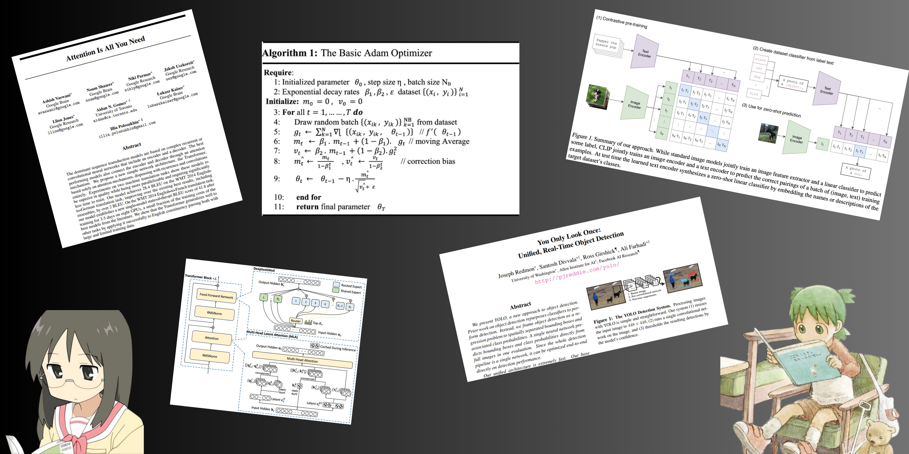

# Paper Implementations

So in this repo I will be adding code for various research papers I’ve implemented.  
Most implementations are in PyTorch.

### Implemented Papers

1. [Adam](https://arxiv.org/abs/1412.6980)  
2. [AlexNet](https://proceedings.neurips.cc/paper_files/paper/2012/file/c399862d3b9d6b76c8436e924a68c45b-Paper.pdf)  
3. [VGG16](https://arxiv.org/abs/1409.1556)  
4. [ResNet34](https://arxiv.org/abs/1512.03385)
5. [YOLOv1](https://arxiv.org/pdf/1506.02640)

I post ML-related stuff on my [Twitter](https://x.com/sodakeyEatsMush) .

